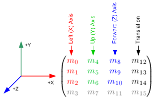
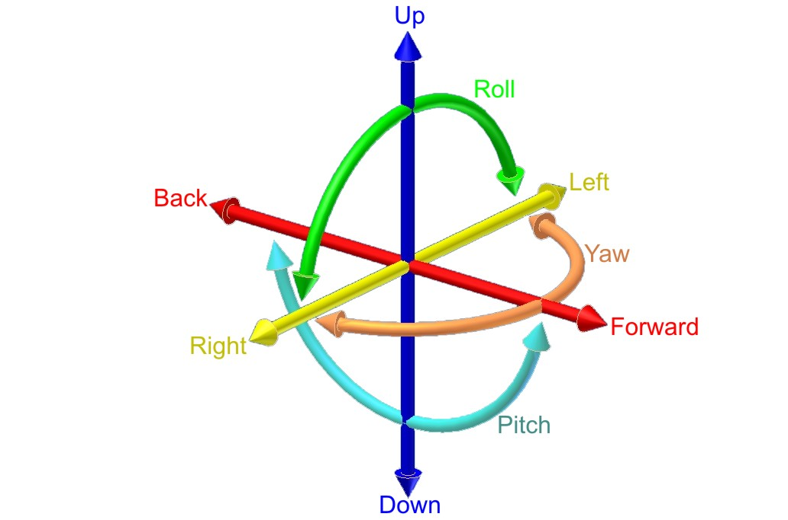

# Godot

You don't need React to write simple standalone pages.

## Assets

- [kaykit dungeon](/assets/kaykit-dungeon.7z)
- [kenney particle pack](/assets/particlePack_1.1.zip)
- [Skeleton](/assets/Skeleton.7z)


Credit:

https://www.kenney.nl/assets/particle-pack
https://kaylousberg.itch.io/kaykit-dungeon

## 3D

### Transform



https://docs.godotengine.org/en/stable/tutorials/3d/using_transforms.html

https://gamedev.stackexchange.com/questions/65783/what-are-world-space-and-eye-space-in-game-development

### Cheat sheet

#### Relative movement

2D
```python
# (move 100 to the right)
t.origin += t.x * 100 
```

3D
```python
# (move 100 to the right)
t.origin += t.basis.x * 100 
```

#### Space ship movement



```python
extends RigidBody

export var input: = NodePath()
onready var _input = get_node(input) 

const ENGINE_POWER := 10.0
const ROTATION_SPEED := 1.0

var speed: float setget ,get_speed
func get_speed() -> float:
	return -global_transform.basis.xform_inv(linear_velocity).z

func _physics_process(_delta: float) -> void:
	add_central_force(compute_thrust() + compute_strafe())
	add_torque(compute_pitch() + compute_yaw() + compute_roll())	

func compute_thrust() -> Vector3:
	return -global_transform.basis.z * _input.throttle * ENGINE_POWER

func compute_strafe() -> Vector3:
	return global_transform.basis.x * _input.strafe * ENGINE_POWER

func compute_pitch() -> Vector3:
	return global_transform.basis.x * -_input.ship_rotation.x * ROTATION_SPEED

func compute_yaw() -> Vector3:
	return global_transform.basis.y * -_input.ship_rotation.y * ROTATION_SPEED

func compute_roll() -> Vector3:
	return global_transform.basis.z * -_input.ship_rotation.z * ROTATION_SPEED
```

https://docs.godotengine.org/en/stable/tutorials/3d/fps_tutorial/part_one.html


https://github.com/31/GodotOnReady

3.2 New csproj style with backport of Godot.NET.Sdk [#41408](https://github.com/godotengine/godot/pull/41408)

C#: Switch games to MSBuild Sdks and .NET Standard [#40595](https://github.com/godotengine/godot/pull/40595)

## Fire particle

```
[gd_scene load_steps=9 format=2]

[ext_resource path="res://assets/particles/fire_01.png" type="Texture" id=1]

[sub_resource type="SpatialMaterial" id=1]
flags_unshaded = true
vertex_color_use_as_albedo = true
params_blend_mode = 1
params_billboard_mode = 3
particles_anim_h_frames = 1
particles_anim_v_frames = 1
particles_anim_loop = false
albedo_texture = ExtResource( 1 )

[sub_resource type="Gradient" id=2]
colors = PoolColorArray( 0.957031, 0.627, 0.112152, 1, 1, 0.226349, 0.0195312, 1 )

[sub_resource type="GradientTexture" id=3]
gradient = SubResource( 2 )

[sub_resource type="Curve" id=4]
_data = [ Vector2( 0, 0.354545 ), 0.0, 0.0, 0, 0, Vector2( 0.496835, 0.872727 ), 0.0, 0.0, 0, 0, Vector2( 1, 0 ), 0.0, 0.0, 0, 0 ]

[sub_resource type="CurveTexture" id=5]
curve = SubResource( 4 )

[sub_resource type="ParticlesMaterial" id=6]
emission_shape = 1
emission_sphere_radius = 0.1
direction = Vector3( 0, 1, 0 )
spread = 0.0
gravity = Vector3( 0, 0, 0 )
initial_velocity = 1.0
angular_velocity_random = 1.0
linear_accel = 1.0
radial_accel_random = 1.0
damping = 1.0
angle = 360.0
scale_random = 1.0
scale_curve = SubResource( 5 )
color_ramp = SubResource( 3 )

[sub_resource type="QuadMesh" id=7]

[node name="Fire" type="Spatial"]

[node name="Particles" type="Particles" parent="."]
material_override = SubResource( 1 )
process_material = SubResource( 6 )
draw_pass_1 = SubResource( 7 )
```
